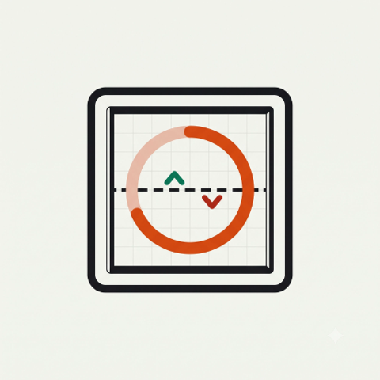
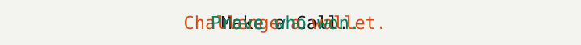
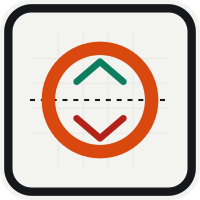
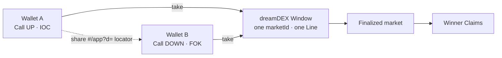
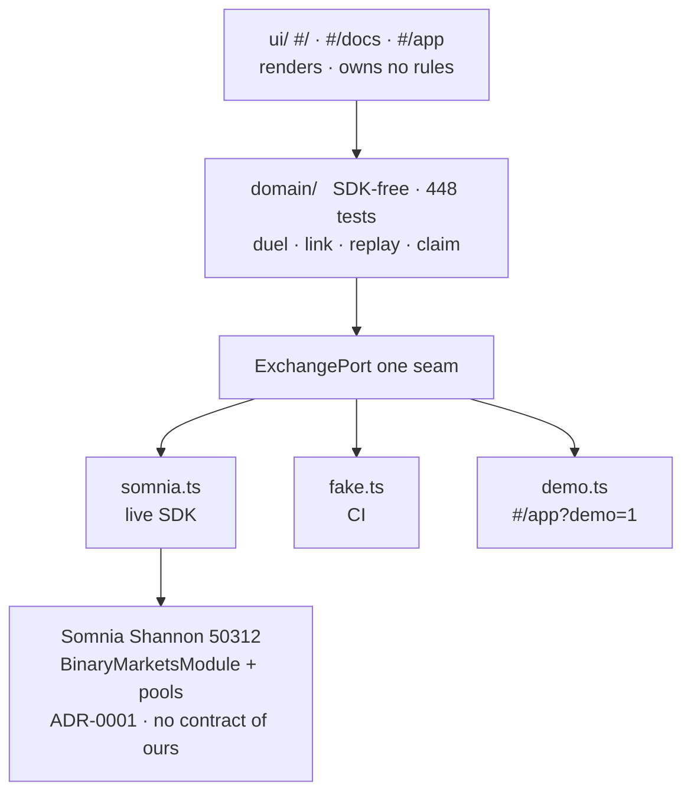

<div align="center">



# Window Duel



### Two opposite fills. One Window. **The chain names the winner.**

The consumer + social layer for [dreamDEX Event Contracts](https://docs.dreamdex.io/developers/event-contracts) on Somnia Shannon.



<br/>

[](docs/VERIFICATION.md)
[](.github/workflows/ci.yml)
[](docs/adr/0001-zero-custom-contracts.md)
[](#trust)
[](https://docs.somnia.network/developer/network-info)
[](LICENSE)

[](https://docs.dreamdex.io/developers/event-contracts)
[](https://docs.somnia.network/developer/network-info)
[](https://www.typescriptlang.org/)
[](https://vitejs.dev/)

**[📺 Demo](#demo)** · **[⚡ Judge it](#judge)** · **[🏗️ Architecture](#architecture)** · **[Judge brief](docs/JUDGING.md)** · **[Verification](docs/VERIFICATION.md)**

| | |
|---|---|
| 📺 **Demo video** | [youtube.com/watch?v=AxVN8ameNo0](https://www.youtube.com/watch?v=AxVN8ameNo0) |
| 🚀 **Live app** | *Pending public HTTPS of the reviewed commit — run locally until then* |
| 📦 **Repo** | [github.com/shreyas-sovani/Window](https://github.com/shreyas-sovani/Window) |

</div>

---

## 🎯 What you get

A verified Up/Down fill becomes a **link you drop in a chat**.

Another wallet opens it. Takes the opposite side of the **same Window**.

When the Window settles, two public fills + the finalized market name the winner.

No backend referee. No custody. **Not one line of custom Solidity.**

> 🛡️ **The trust boundary.** <a id="trust"></a> The URL is a locator, never evidence. Tamper any field — the tape wins. A submitted-but-unfilled tx earns no receipt, no challenge, no victory screen.

---

## 📺 Demo
<a id="demo"></a>

<div align="center">

[](https://www.youtube.com/watch?v=AxVN8ameNo0)

[](https://www.youtube.com/watch?v=AxVN8ameNo0)

</div>

Labeled **demo mode** — the full two-wallet loop on a simulated market.

Shannon had no executable depth. Empty book = no Call. We do not invent a 50% price.

Replay it locally in [step 2](#judge).

---

## 🏗️ Architecture
<a id="architecture"></a>

Two humans. One market. Three adapters. **Zero of our contracts.**

<div align="center">


</div>





Same rules on Shannon, in CI, and in the recording. `domain/` cannot import the SDK. Divergence is illegal.

---

## ⚡ Judge it in five minutes
<a id="judge"></a>

No wallet. No funds. No gas.

| # | Do this | You just proved |
|:-:|---|---|
| 1️⃣ | `npm install && npm test` | **448 tests**, offline |
| 2️⃣ | `#/app?demo=1` → Connect → Approve → **Call Up** → **Demo opponent accepts** | Full loop: fill → challenge → accept → settle → winner-only Claim |
| 3️⃣ | Open the minted link in a second tab | Self-contained locator. One action: the opposite side |
| 4️⃣ | Edit the payload. Reload | **Fail-closed.** Tape outranks the URL |
| 5️⃣ | `#/docs` + two hashes. Try to pick a winner | You can't. Settlement is read, not chosen |

---

## 🔥 Why this wins the brief

<table>
<tr>
<td width="33%" valign="top">

### 📈 Volume the venue cannot create

The CLOB asks *price and size*.

We ask *up or down?*

**One invite = an attempt at a second real take** on the same Window.

</td>
<td width="33%" valign="top">

### 🧭 Honest where products lie

No book → no Call.

No invented 50%.

No receipt until the tape witnesses the fill.

Verifying ≠ refused.

</td>
<td width="33%" valign="top">

### 🔒 Zero new trust

Zero contracts. Zero custody. Zero server.

Social opponents — **not** counterparties.

A judge can verify a duel **without this app**.

</td>
</tr>
</table>

Nine evidence-backed SDK findings from actually integrating Event Contracts: [`docs/SDK-FEEDBACK.md`](docs/SDK-FEEDBACK.md).

---

## ⚔️ The duel

| Step | Move | Honest rule |
|---|---|---|
| ⬆️⬇️ **Call** | Stake. `Risk X → Win Y`. Live book | No book, no Call |
| ✅ **Verify** | Decode the tx receipt on the spot | Chain first. Indexer is backup |
| 🔗 **Challenge** | Mint `#/app?d=…` — named, floored, short-lived | Only a witnessed fill mints a link |
| 💥 **Accept** | Opposite side. **FOK** | Whole stake or nothing |
| 🏁 **Resolve** | URL grows `&a=<acceptTx>` | Unrelated opposite fills never count |
| 💰 **Claim** | Winner only. Rematch on the successor | Void = draw. Loser is not paid |

---

## 🧪 Demo mode

`#/app?demo=1` — the real product on its third adapter. Badged on every screen.

- Every cadence chip has a live Window (2.5–6 min), from the wall clock.
- Real six-level ladder. ~2,700 tUSDC a side. Big Calls pay a worse average.
- Links carry fills (`&s=…`). A second tab is enough. Or **Demo opponent accepts**.
- Settlement is deterministic per `marketId`. Only the winner Claims.

Never presented as chain evidence.

---

## ▶️ Run it

```bash
cp .env.example .env && npm install && npm test && npm run dev
```

**Demo:** `#/app?demo=1`

**Live Shannon:**

1. Wallet → chain `50312` · RPC `https://api.infra.testnet.somnia.network` · explorer [shannon-explorer.somnia.network](https://shannon-explorer.somnia.network)
2. Gas: [testnet.somnia.network](https://testnet.somnia.network) · tUSDC: in-app **Mint tUSDC**
3. Connect → Switch → Mint → Approve the exact stake → **Call**
4. Share the link. Opposite wallet accepts. Claim after finalize

Thin book? FOK refuses. Stake small, or record in demo mode.

---

<details>
<summary><b>🧰 What else is in the terminal</b></summary>

<br>

| | |
|---|---|
| Question-first board | Line, depleting lock ring, odds, volume |
| Market health | Spread + walked depth + time-to-lock. Never claims depth it cannot see |
| `best` cadence | Jumps to the callable Window |
| Proof cards | Plain-text receipts. No backend |
| Claim session | 40 newest finalized Windows, every venue, fee-aware |
| Pulse | Sparklines + public tape. Pure SVG |
| Book drawer | Up ladder + post-only Rest (dies at lock) |
| Wallet P&L | Avg-cost, explorer-linked |
| Write safety | One tx at a time. Mutex. No double-fire |

</details>

<details>
<summary><b>📚 Where everything lives</b></summary>

<br>

| | |
|---|---|
| [`docs/JUDGING.md`](docs/JUDGING.md) | Criterion → evidence |
| [`docs/VERIFICATION.md`](docs/VERIFICATION.md) | Every claim + the command that proves it |
| [`docs/DEMO.md`](docs/DEMO.md) | 2–5 minute script |
| [`docs/PRD.md`](docs/PRD.md) | In scope / deliberately not |
| [`docs/SDK-FEEDBACK.md`](docs/SDK-FEEDBACK.md) | 9 field-report items |
| [`docs/BACKLOG.md`](docs/BACKLOG.md) | Every ticket, in order |
| [`docs/adr/`](docs/adr/) | Zero contracts · SDK only · domain stays pure |
| [`CONTEXT.md`](CONTEXT.md) | Window · Line · Call · Claim · Duel |
| [`submission.md`](submission.md) | DoraHacks BUIDL paste |

</details>

---

## 🛡️ Honest limits

We would rather write these than have a judge find them.

| | |
|---|---|
| **Proof tuple** | No invented Shannon hashes. Live `marketId` + two txs still pending |
| **Live URL** | Public HTTPS of the reviewed commit still pending |
| **Recording** | [3-min demo](https://www.youtube.com/watch?v=AxVN8ameNo0) is labeled demo mode |
| **Thin books** | FOK accept refused when the other side cannot cover. We name it |
| **Audit** | 25 transitive wagmi findings (2 high, 23 moderate). No criticals. Fix = wagmi 3 |
| **Users** | Runnable. Nobody outside the team has used it |

`npm test` + `npm run build` are the gate. CI rejects critical advisories.

---

<div align="center">


**⚡ zero contracts · zero custody · zero referee ⚡**

[Event Contracts](https://docs.dreamdex.io/developers/event-contracts) · [recipes](https://docs.dreamdex.io/developers/event-contracts/recipes) · [gotchas](https://docs.dreamdex.io/developers/event-contracts/gotchas) · [addresses](https://docs.dreamdex.io/developers/event-contracts/contracts-and-addresses) · [Somnia](https://docs.somnia.network/developer/network-info)

MIT · Somnia × dreamDEX Event Contracts Hackathon

</div>
